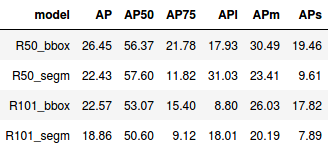

# Stem cells segmentation and tracking on videos via Detectron2

There are images (frames) with mesenchymal stem cells (MSC). There is a need to track individual cells and analyse the dinamics of their movements on videos (cell migration analysis).

## Pipeline

- instance segmentation with **Mask R-CNN R-50/101 FPN**
- tracking with centroid_multi_tracker

## Labeled dataset

- train: 137 images (2010 cells)
- test: 57 images (722 cells)

## Tools and libs

- python 3.7
- Labelme 3.16 (labeling)
- Clodsa 1.2 (augmentation)
- OpenCV 3.4
- Pytorch 1.5
- **Detectron2** 0.1.3

## Training on Google Colaboratory (GPU, Tesla P100)

## Metrics

